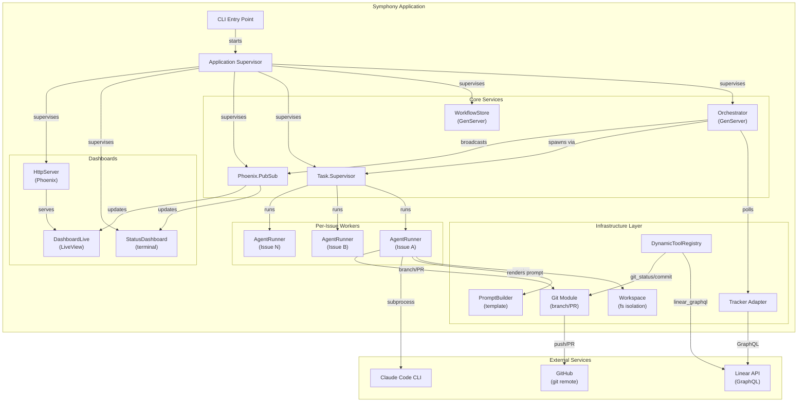
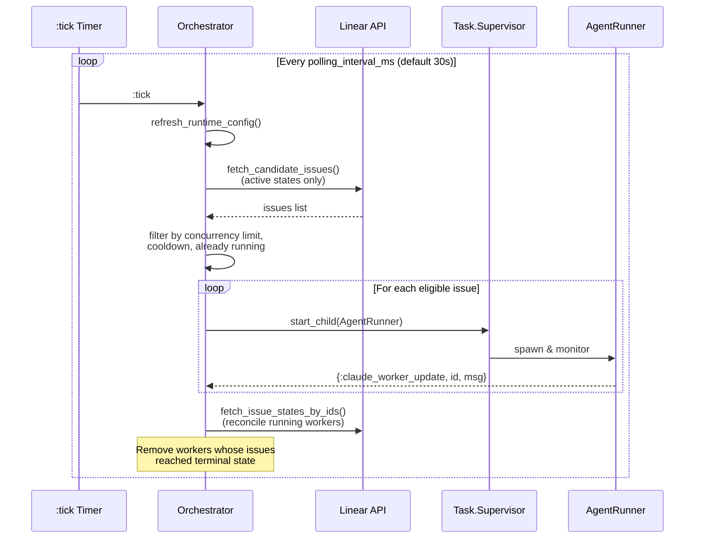
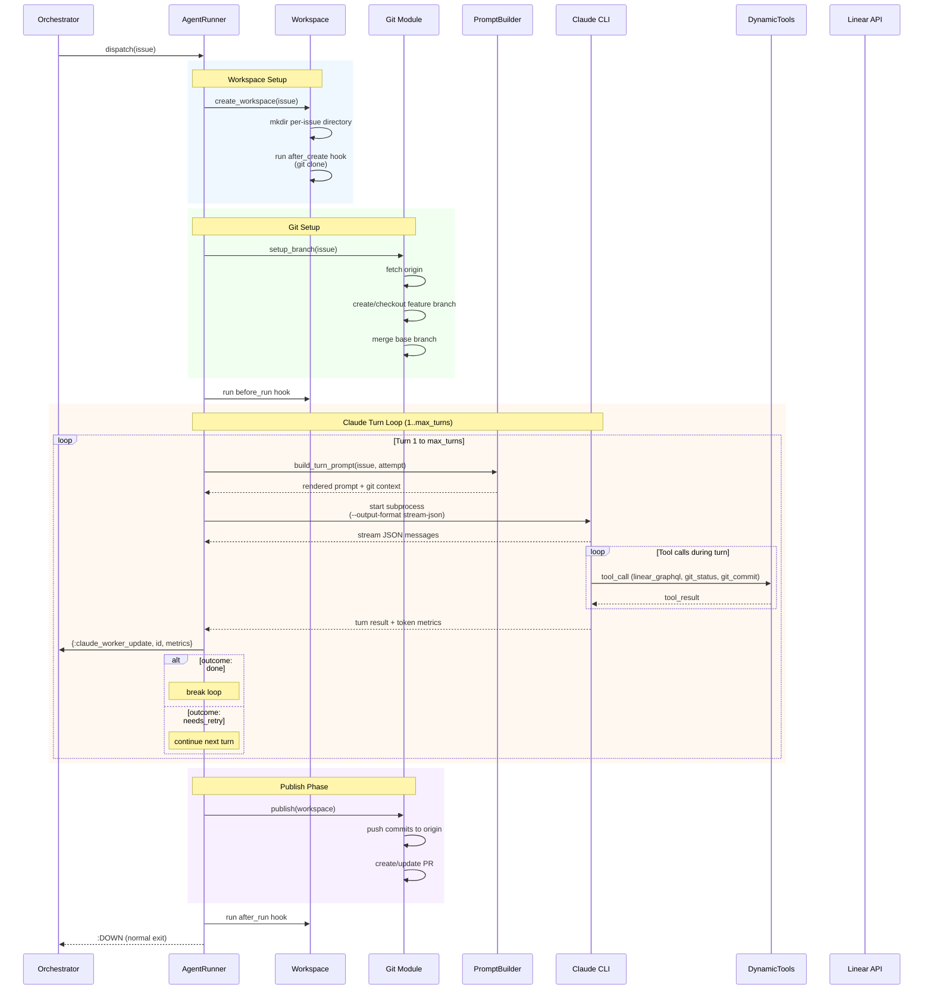
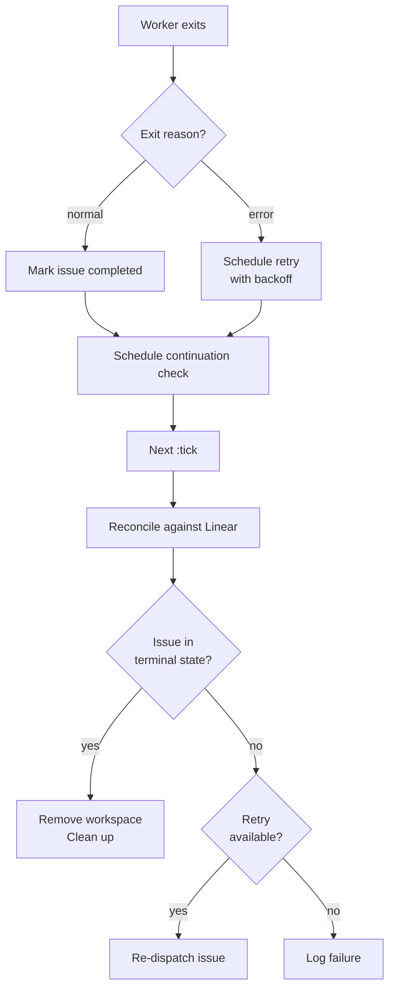
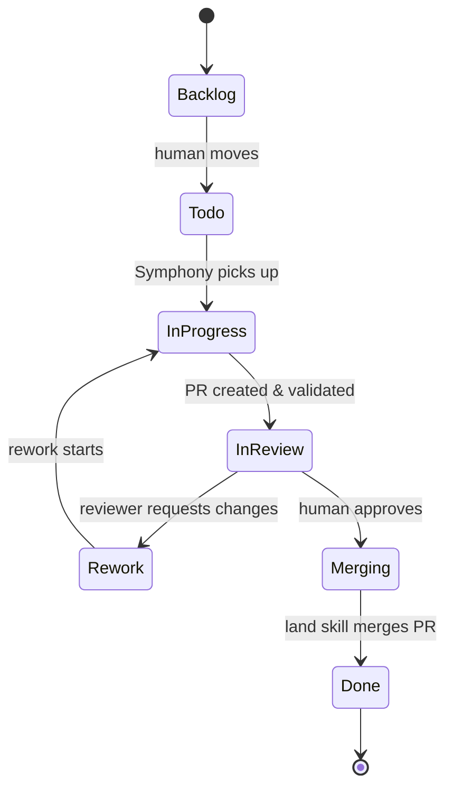
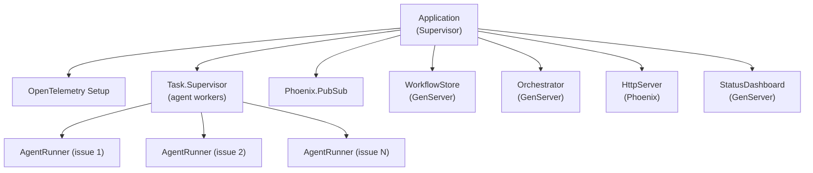
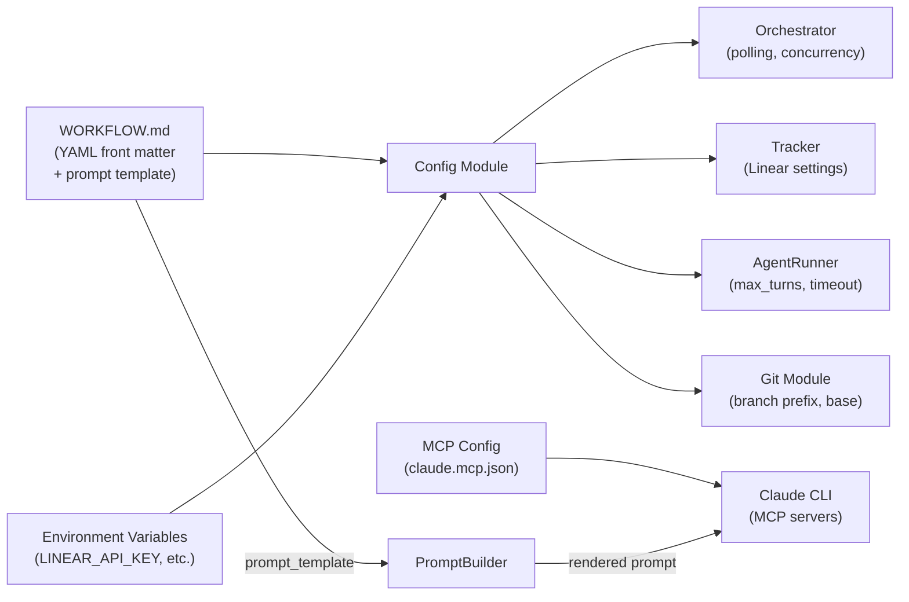

# Symphony Architecture

Symphony is an Elixir service that transforms Linear issues into autonomous Claude Code sessions. It polls a Linear project for eligible issues, creates isolated per-issue workspaces, launches Claude Code CLI in each workspace, and tracks progress until issues reach terminal states.

## System Overview

## Polling & Dispatch Loop

## Issue Execution Lifecycle

## Worker Exit & Retry Flow

## Issue State Machine

## Supervision Tree

## Configuration Flow

