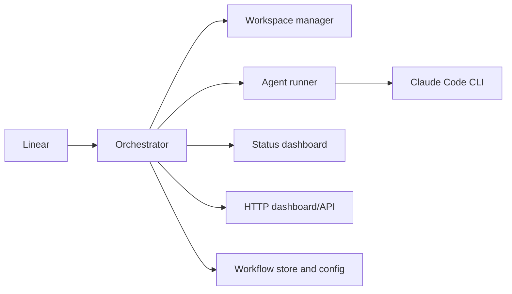
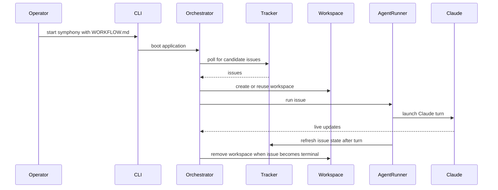

# Architecture Overview

This guide explains the system in backend-service terms first, then maps those ideas to the Elixir
implementation.

## System View

## End-To-End Flow

## Core Runtime Components

### `CLI`

What this means:
The command-line boundary that validates flags, chooses the workflow file, and starts the app.

Why Symphony needs it:
The service must be startable with one explicit runtime contract and a small set of overrides.

Where it lives in code:
`lib/symphony_elixir/cli.ex`

What can go wrong:
bad flags, missing workflow file, or missing acknowledgement flag stop startup immediately.

### `Workflow` and `Config`

What this means:
The configuration layer that loads `WORKFLOW.md`, parses its YAML front matter, exposes defaults, and
enforces required settings.

Why Symphony needs it:
The orchestrator should read normalized runtime settings, not manually parse raw YAML on every call.

Where it lives in code:
`lib/symphony_elixir/workflow.ex`, `lib/symphony_elixir/config.ex`, `lib/symphony_elixir/workflow_store.ex`

What can go wrong:
invalid YAML, missing tracker settings, bad Claude policy values, or empty Claude command.

### `Orchestrator`

What this means:
The long-running scheduler that owns polling, dispatch, retry bookkeeping, running-worker tracking,
and terminal-state cleanup.

Why Symphony needs it:
This is the control plane of the whole service.

Where it lives in code:
`lib/symphony_elixir/orchestrator.ex`

What can go wrong:
tracker failures, invalid runtime config, exhausted concurrency, or repeated worker crashes.

### `Workspace`

What this means:
The filesystem isolation layer that creates, validates, reuses, and deletes issue directories.

Why Symphony needs it:
Claude should operate in one bounded directory per issue, not in a shared mutable checkout.

Where it lives in code:
`lib/symphony_elixir/workspace.ex`

What can go wrong:
hook failures, workspace path escapes, or broken bootstrap commands.

### `AgentRunner`

What this means:
The worker-side executor that turns one issue into one or more Claude CLI turns.

Why Symphony needs it:
The scheduler decides what to run; the agent runner performs the actual issue work.

Where it lives in code:
`lib/symphony_elixir/agent_runner.ex`

What can go wrong:
Claude startup failures, timeouts, issue refresh failures, or continuation loops ending too early.

### `StatusDashboard` and `HttpServer`

What this means:
The observability layer for terminal and HTTP status output.

Why Symphony needs it:
Operators need live visibility into polling state, active workers, and token activity.

Where it lives in code:
`lib/symphony_elixir/status_dashboard.ex`, `lib/symphony_elixir/http_server.ex`

What can go wrong:
dashboard disabled, HTTP port not configured, or rendering failures that only affect visibility.

## Application Startup Model

At boot, the application starts these core children under one supervisor:

- task supervisor
- Phoenix PubSub
- workflow store
- orchestrator
- HTTP server
- status dashboard

For a non-Elixir reader, treat that as "the process tree for long-lived runtime services."

## Why Elixir Fits This Project

The project benefits from BEAM/OTP features that are directly relevant to this workload:

- supervising long-running services,
- isolating worker failures,
- keeping a scheduler responsive while child tasks do blocking work,
- building a live dashboard without turning the entire runtime into callback spaghetti.

For the Elixir/OTP concepts behind that statement, see [Elixir For Readers](./elixir-for-readers.md).
For a module-by-module map, see [Code Map](./code-map.md).
