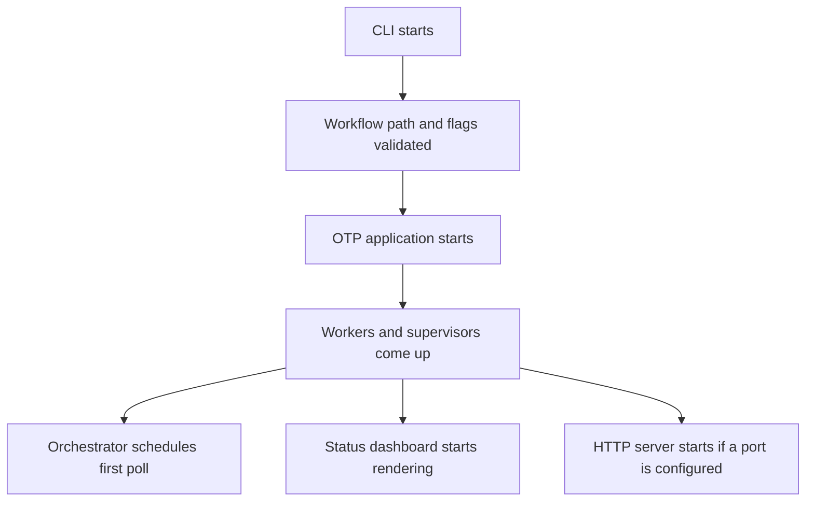
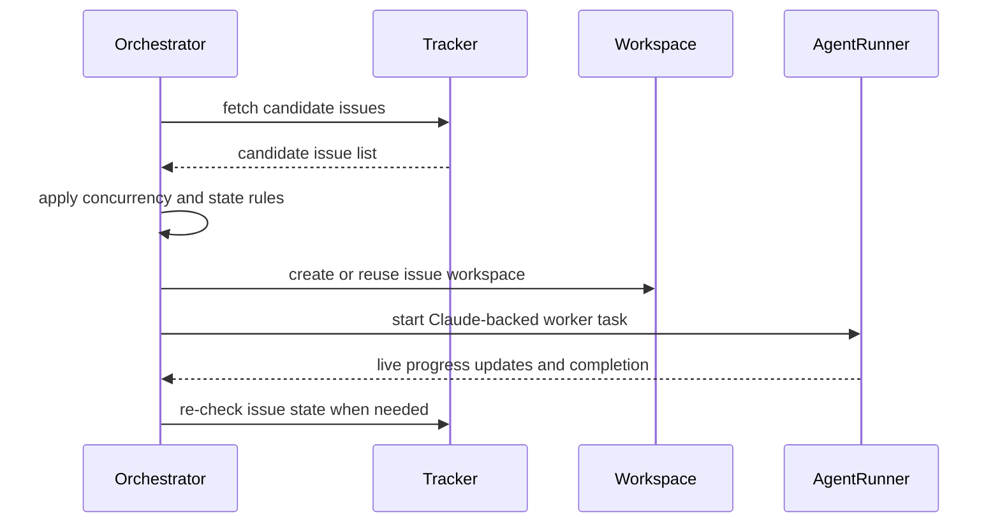
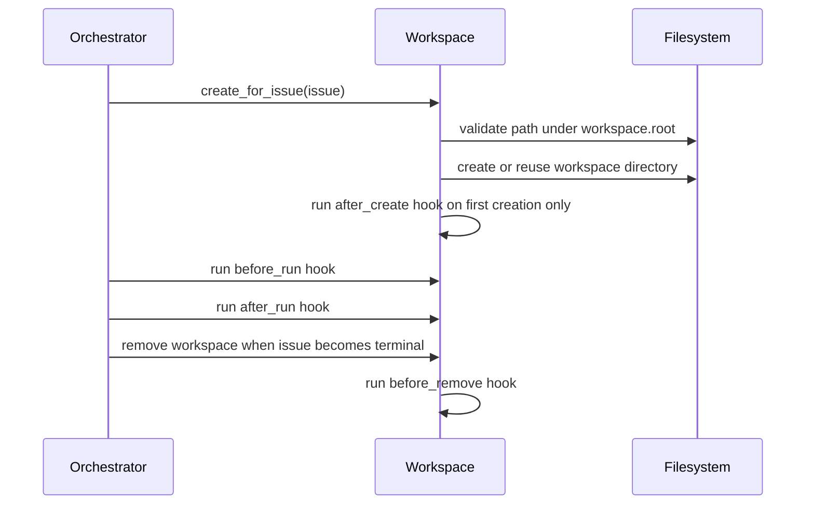
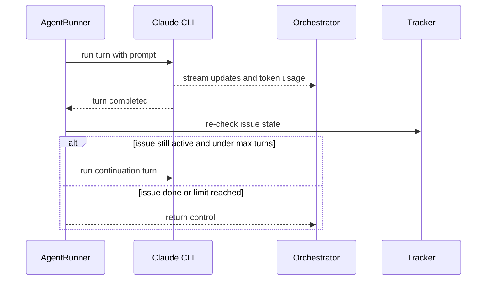

# Operations Guide

This guide explains what Symphony does at runtime, in system terms rather than Elixir terms.

## Startup Sequence

## Poll Loop

## Polling And Dispatch

### What This Means

The orchestrator is the scheduler. On each poll cycle it refreshes runtime config, reconciles
already-running issues, fetches candidate issues from the tracker, and dispatches new work only if
capacity is available.

### Why Symphony Needs It

Without a central scheduler, two bad things happen:

- the same issue can be started multiple times,
- a flood of candidate issues can exhaust local machine capacity.

### Where It Lives In Code

- `lib/symphony_elixir/orchestrator.ex`
- `lib/symphony_elixir/tracker.ex`
- `lib/symphony_elixir/config.ex`

### What Can Go Wrong

- missing Linear token or project slug: no dispatch happens
- tracker API failures: poll loop keeps running but logs errors
- too little capacity: issues remain queued until slots free up

## Internal Issue Claiming

### What This Means

Symphony keeps in-memory sets for:

- running issues,
- completed issues,
- claimed issues,
- retry attempts.

It does not "claim" an issue by mutating Linear state at the scheduler layer. Claiming here means
"the orchestrator has decided this issue is already owned by an active local worker."

### Why Symphony Needs It

This prevents duplicate local execution during overlapping poll cycles and while retry timers are
pending.

### Where It Lives In Code

- `Orchestrator.State`
- dispatch and retry bookkeeping inside `orchestrator.ex`

### What Can Go Wrong

- if the worker exits abnormally, the issue moves from running state into retry scheduling
- if the issue changes to a terminal state externally, Symphony stops the active worker and cleans up

## Workspace Lifecycle

### What This Means

Each issue gets a stable directory under `workspace.root`. If the directory already exists, Symphony
reuses it and only cleans selected transient entries such as `.elixir_ls` and `tmp`.

### Why Symphony Needs It

Continuation turns and retry attempts need a persistent working directory. That is how Claude can
resume rather than starting from scratch.

### Where It Lives In Code

- `lib/symphony_elixir/workspace.ex`

### What Can Go Wrong

- hook timeout: the issue fails before Claude runs
- hook exit status non-zero: the issue fails and is retried
- workspace path outside the configured root or symlink escape: workspace creation is rejected

## Claude Turn Lifecycle

### What This Means

One worker run may contain multiple Claude turns. After each normal completion, Symphony checks the
issue state again. If the issue is still in an active state and `agent.max_turns` has not been
reached, it sends a continuation prompt and keeps going.

### Why Symphony Needs It

Claude may stop after a normal turn even though the Linear issue is still in progress. Continuation
turns let Symphony push the work forward without waiting for the next scheduler poll.

### Where It Lives In Code

- `lib/symphony_elixir/agent_runner.ex`
- Claude CLI integration modules

### What Can Go Wrong

- Claude command missing or invalid: worker fails immediately
- issue state refresh fails: the worker returns an error to the orchestrator
- Claude stalls or exceeds turn timeout: the run fails and re-enters retry logic

## Retry Behavior

### What This Means

When a worker exits abnormally, the orchestrator schedules a retry with backoff. When a worker exits
normally but the issue is still active, the orchestrator also schedules a short continuation check.
If Claude reports that the account has hit its usage limit and provides a reset time, Symphony
enters a global cooldown and blocks new Claude subprocess launches until that reset time.

### Why Symphony Needs It

Transient failures are normal in long-running automation: network issues, tool failures, tracker
flakiness, or temporary Claude errors.

### Where It Lives In Code

- retry scheduling and attempt tracking in `orchestrator.ex`

### What Can Go Wrong

- a hard configuration error causes repeated failed retries until fixed
- very large issue backlogs can delay retries because capacity is shared
- a malformed Claude usage-limit message falls back to normal retry/backoff instead of an exact
  cooldown deadline

## Terminal-State Cleanup

### What This Means

If an issue moves into a terminal state such as `Done`, `Closed`, `Cancelled`, or `Duplicate`,
Symphony stops active work for that issue and removes matching workspaces.

### Why Symphony Needs It

The scheduler should not keep spending resources on issues that humans have already closed or
cancelled.

### Where It Lives In Code

- running issue reconciliation in `orchestrator.ex`
- workspace removal in `workspace.ex`

### What Can Go Wrong

- if cleanup hooks fail, workspace removal still continues where possible
- if the tracker cannot be refreshed, Symphony keeps the active worker rather than guessing

## Observability Surfaces

Use these in order:

1. terminal dashboard for live local state
2. log files for detailed failure context
3. HTTP dashboard and JSON API if enabled

Related docs:

- [Observability Guide](./observability.md)
- [Troubleshooting](./troubleshooting.md)
- [Logging Best Practices](./logging.md)
- [Claude Code Token Accounting](./token_accounting.md)
